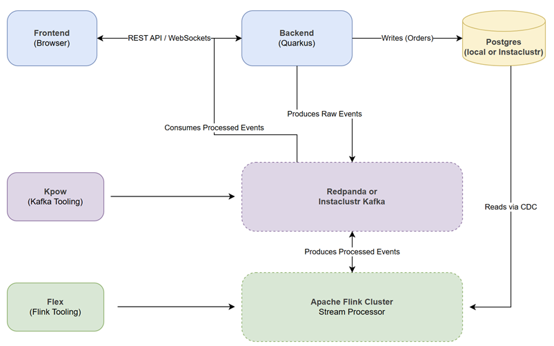
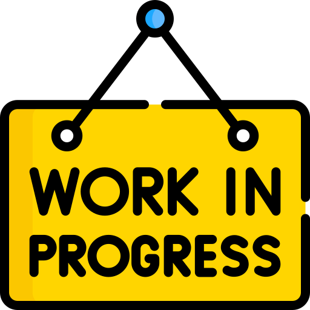

# 🎓 APAC Roadshow 2025

## Overview

Welcome to the APAC Roadshow 2025 workshop! This guide provides complete instructions for setting up and running the KartShoppe training platform **from a blank slate**. KartShoppe is a fully-functional, real-time e-commerce application designed to teach modern data engineering principles.

This session is designed for participants to start with just the source code and progressively build, deploy, and enhance the platform by introducing powerful stream processing capabilities with Apache Flink.

---

## 🎯 Key Learning Objectives

By the end of this workshop, you will have hands-on experience with:

-   **Apache Flink Fundamentals:** Go from zero to building sophisticated, stateful stream processing jobs. You'll learn to implement sources, sinks, transformations, and windowing to solve real business problems.
-   **Event-Driven Architecture:** Understand how to use Kafka as the central nervous system of a modern, decoupled application.
-   **Reactive Microservices:** See how a Quarkus-based backend can consume, process, and serve data from Flink and Kafka, pushing live updates directly to a web UI.
-   **Database Change Data Capture (CDC):** Learn to capture row-level changes from a PostgreSQL database in real-time and turn them into an event stream for Flink to process.
-   **Stateful Stream Processing:** Implement practical, stateful logic to solve classic e-commerce challenges like real-time inventory management.

---

## 💡 Training Philosophy

This setup follows a **progressive, hands-on learning approach** designed for maximum impact:

1.  **Start with a Working System:** You'll begin by launching the core KartShoppe application. It's a functional e-commerce site with a UI, API, and message broker, but with a key piece missing: **real-time intelligence**.

2.  **Incremental Enhancements:** Each training module guides you through developing and deploying a specific Flink job. You won't just learn theory; you'll solve a real business problem with each job you write.

3.  **Tangible, Visual Feedback:** As soon as you deploy a Flink job, you will see a new feature come to life in the KartShoppe UI. Watch as inventory counts update in real-time, order statuses change instantly, and product recommendations appear based on user behavior. This immediate feedback loop makes learning concrete and rewarding.

---

## 🌟 Application Highlights

### Overall Architecture



### Backend API


### Flink Apps


---

## 🚀 Before Training Day

### Prerequisites

Ensure students have:
- **Docker (or Docker Desktop)** installed and running
- **8GB RAM** minimum (16GB recommended)
- **Internet connection** (for downloading dependencies)
- **macOS or Linux** (Windows with WSL2 works too)

### One-Time Environment Setup

**Run this script ONCE before the training:**

```bash
./setup-environment.sh
```

This installs:
- ✅ SDKMAN (Java version manager)
- ✅ Java 11 (for building Flink jobs)
- ✅ Java 17 (for running Quarkus)
- ✅ Verifies Docker Desktop
- ✅ Verifies Node.js 18+

**Estimated time:** 5-10 minutes

**Expected output:**
```
╔════════════════════════════════════════════════════════════════╗
║              ✨  Setup Completed Successfully!  ✨             ║
╚════════════════════════════════════════════════════════════════╝

Installed Components:
  ✓ Docker:     Docker version 24.x
  ✓ Node.js:    v20.x.x
  ✓ npm:        10.x.x
  ✓ SDKMAN:     5.x.x
  ✓ Java 11:    11.0.25-tem
  ✓ Java 17:    17.0.13-tem
```

---

## 📚 Training Day Schedule

### Deploy Instaclustr Kafka and Postgres Services

**Paul to update**

<p align="center">
  
</p>

### Request Factor House Community License

**Jae to update**

<p align="center">
  
</p>

### Platform Startup

#### Goal

Get the core KartShoppe platform running **without any Flink jobs**.

#### What's Running?

```
┌─────────────────────────────────────────────────────────────┐
│  PLATFORM ARCHITECTURE (No Flink Yet)                       │
├─────────────────────────────────────────────────────────────┤
│                                                             │
│  Frontend (React) ←─ Quinoa ─→ Quarkus API                  │
│                                     ↓                       │
│                                WebSockets                   │
│                                     ↓                       │
│                                   Kafka                     │
│                                                             │
└─────────────────────────────────────────────────────────────┘
```

#### Steps

<details>
  <summary><b>With Instaclustr Managed Services</b></summary>

   - to be updated

</details>

<br>

<details>
  <summary><b>With Local Docker Services</b></summary>

1. **Start the platform:**
   ```bash
   ./start-platform-local.sh
   ```

2. **Wait for startup** (30-60 seconds)

3. **Access the application:**
   - KartShoppe App: http://localhost:8081
   - Quarkus Dev UI: http://localhost:8081/q/dev

4. **Start the Flink app for order processing and inventory management:**
   ```bash
   ./flink-inventory-with-orders-job.sh 
   ```

5. **Monitor Kafka and Flink:**
   - Kpow for Apache Kafka: http://localhost:4000
   - Flex for Apache Flink: http://localhost:5000

4. **Explore the UI:**
   - Browse products
   - Add items to cart

</details>

---

### Run Flink Applications

#### Learning Objectives
- Understand Flink's keyed state
- Learn about event-time processing
- See real-time state updates

#### Concepts Covered
1. **Keyed State** - Per-product inventory tracking
2. **Timers** - Timeout detection for low stock
3. **Side Outputs** - Multi-way event routing
4. **File + Kafka Hybrid Source** - Bootstrap from files, continue with streaming

#### Start the Inventory Job

**In a new terminal:**
```bash
./flink-inventory-with-orders-job.sh
```

#### What Happens?

1. **Initial Load:**
   - Reads `data/initial-products.json`
   - Loads ~44 products into Flink state
   - Publishes to Kafka → Quarkus → Frontend

2. **Real-time Updates:**
   - Listens to `inventory_updates` Kafka topic
   - Updates stock levels in real-time
   - Detects low-stock conditions
   - Routes alerts via side outputs

3. **Visible in UI:**
   - Product inventory counts appear
   - Stock levels update live when you add to cart
   - Low-stock warnings (if stock drops below threshold)

#### Monitor the Job

- **View Kafka topics with Kpow:** http://localhost:4000
   - Key topics
      - `products`
      - `order-events`
      - `product_update`
      - `inventory-events`
      - `inventory-alerts`
- **View Flink jobs with Flex:** http://localhost:5000
- **Check state:** http://localhost:8081/api/ecommerce/inventory/state

#### Hands-On Exercise

1. Add 10 items of the same product to your cart
2. Watch the inventory count decrease in real-time
3. Check Flink dashboard to see events processed
4. View Kafka topic to see inventory update messages

---

## 📁 Project Structure

> Jae to update!

```
Ververica-visual-demo-1/
├── 0-setup-environment.sh              # One-time prerequisite setup
├── start-training-platform.sh          # Start platform (no Flink)
├── stop-platform.sh                    # Stop everything
├──
├── flink-1-inventory-job.sh            # Module 1: Inventory management
├── flink-2-basket-analysis-job.sh      # Module 2: Recommendations
├── flink-3-hybrid-source-job.sh        # Module 3: Warm-start with history
├── flink-4-shopping-assistant-job.sh   # Module 4: AI chat
├──
├── quarkus-api/                        # Backend API (Java 17)
├── kartshoppe-frontend/                # React frontend
├── flink-inventory/                    # Flink inventory job (Java 11)
├── flink-recommendations/              # Flink basket analysis (Java 11)
├── models/                             # Shared data models
├── docker-compose.yml                  # Infrastructure config
└── data/                               # Sample data files
```

---

## 🎓 Training Tips

### For Instructors

1. **Show, then explain:** Start each Flink job, show the visible change, THEN explain the concepts
2. **Use the UI constantly:** Keep the browser open, refresh often to show real-time updates
3. **Monitor Flink dashboard:** Show the job graph, metrics, backpressure (http://localhost:8081)
4. **Explore Kafka topics:** Use Redpanda Console to see messages flowing (http://localhost:4000)
5. **Explain incrementally:** Each module builds on the previous - don't overwhelm with all patterns at once

### For Students

1. **Follow along:** Run commands in your own terminal
2. **Experiment:** Try breaking things! Stop a Flink job, see what happens, restart it
3. **Ask questions:** Why does this pattern need keyed state? Why use broadcast state here?
4. **Monitor everything:** Open all dashboards (Flink, Redpanda, Quarkus Dev UI)
5. **Read the logs:** `tail -f logs/quarkus.log` and Flink job logs show what's happening

---

## 🐛 Troubleshooting

### Platform Won't Start

```bash
# Check Docker
docker info

# Check Java version
java -version  # Should be 17+

# View logs
tail -f logs/quarkus.log
docker compose logs -f
```

### Flink Job Fails to Start

```bash
# Switch to Java 11 for building Flink jobs
sdk use java 11.0.25-tem

# Rebuild
./gradlew :flink-inventory:clean :flink-inventory:shadowJar

# Check logs
tail -f logs/inventory.log
```

### Port Conflicts

```bash
# Kill process on port 8081 (Quarkus)
lsof -ti:8081 | xargs kill -9

# Kill process on port 8082 (Flink, if running)
lsof -ti:8082 | xargs kill -9
```

### Clean Slate Reset

```bash
# Stop everything
./stop-platform.sh

# Clean Docker volumes
docker compose down -v

# Clean Gradle cache
./gradlew clean

# Restart
./start-training-platform.sh
```

---

## 🎯 Learning Outcomes

By the end of this training, students will:

✅ Understand **Flink's core concepts**: streams, state, time, windows
✅ Build **stateful stream processing** applications
✅ Integrate **Kafka/Redpanda** for event streaming
✅ Deploy **ML models in real-time** with broadcast state
✅ Use **CEP patterns** for complex event detection
✅ Combine **batch and streaming** with hybrid sources
✅ Build **reactive microservices** with Quarkus
✅ Create **real-time data pipelines** end-to-end

---

## 📖 Additional Resources

- [Apache Flink Documentation](https://flink.apache.org)
- [Apache Paimon Documentation](https://paimon.apache.org)
- [Quarkus Guides](https://quarkus.io/guides/)
- [Redpanda Documentation](https://docs.redpanda.com)
- [Ververica Academy](https://www.ververica.com/academy)

---

### Key URLs

| Service | URL |
|---------|-----|
| **KartShoppe App** | http://localhost:8081 |
| **Quarkus Dev UI** | http://localhost:8081/q/dev |
| **Kpow for Apache Kafka** | http://localhost:4000 |
| **Flex for Apache Flink** | http://localhost:5000 |

---