# 🎓 Resilient Event Systems Workshop

## Overview

Welcome to the _Building Resilient Event-Driven Systems with Kafka and Flink_ workshop! This guide provides complete instructions for setting up and running the KartShoppe training platform **from a blank slate**. KartShoppe is a fully-functional, real-time e-commerce application designed to teach modern data engineering principles.

This session is designed for participants to start with just the source code and progressively build, deploy, and enhance the platform by introducing powerful stream processing capabilities with Apache Kafka and Apache Flink.

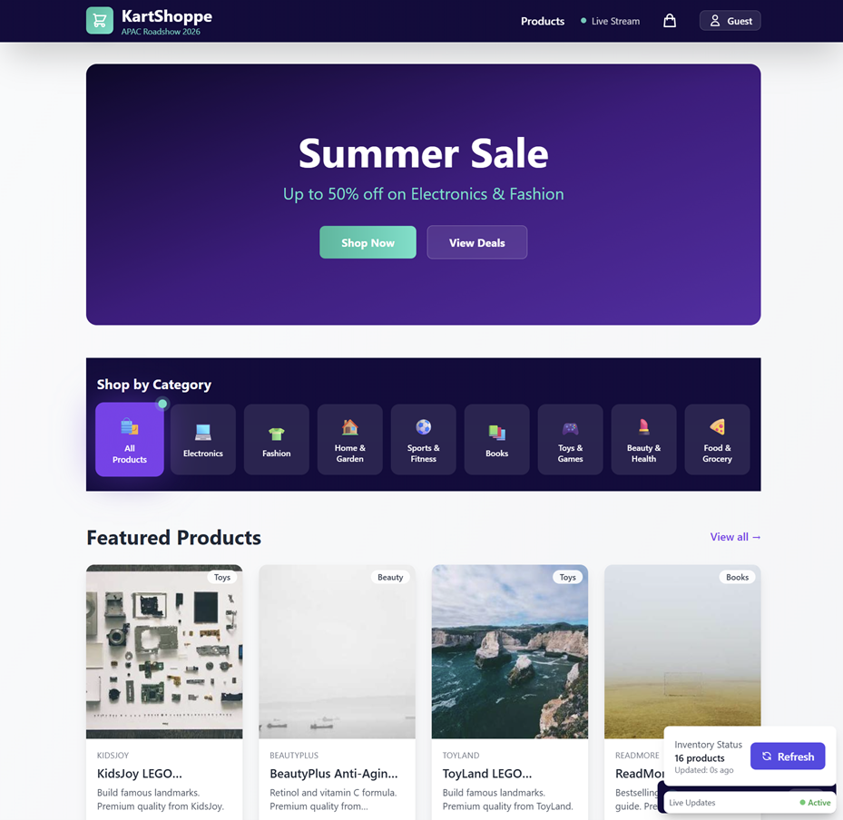

---

## 🎯 Key Learning Objectives

By the end of this workshop, you will have hands-on experience with:

- **Event-Driven Architecture:** Understand how to use Kafka as the central nervous system of a modern, decoupled application.
- **Apache Flink Fundamentals:** Go from zero to building sophisticated, stateful stream processing jobs. You'll learn to implement sources, sinks, transformations, and windowing to solve real business problems.
- **Reactive Microservices:** See how a Quarkus-based backend can consume, process, and serve data from Flink and Kafka, pushing live updates directly to a web UI.
- **Database Change Data Capture (CDC):** Learn to capture row-level changes from a PostgreSQL database in real-time and turn them into an event stream for Flink to process.
- **Stateful Stream Processing:** Implement practical, stateful logic to solve classic e-commerce challenges like real-time inventory management.

---

## 💡 Training Philosophy

This setup follows a **progressive, hands-on learning approach** designed for maximum impact:

1.  **Start with a Working System:** You'll begin by launching the core KartShoppe application. It's a functional e-commerce site with a UI, API, and message broker, but with a key piece missing: **real-time data processing**.

2.  **Incremental Enhancements:** The workshop guides you through developing and deploying specific Flink jobs. You won't just learn theory; you'll solve a real business problem with each job you write.

3.  **Tangible, Visual Feedback:** As soon as you deploy a Flink job, you will see a new feature come to life in the KartShoppe UI. Watch as inventory counts update in real-time and order statuses change instantly based on user behavior. This immediate feedback loop makes learning concrete and rewarding.

---

## 🌟 Application Highlights

### Overall Architecture

<p align="center">
  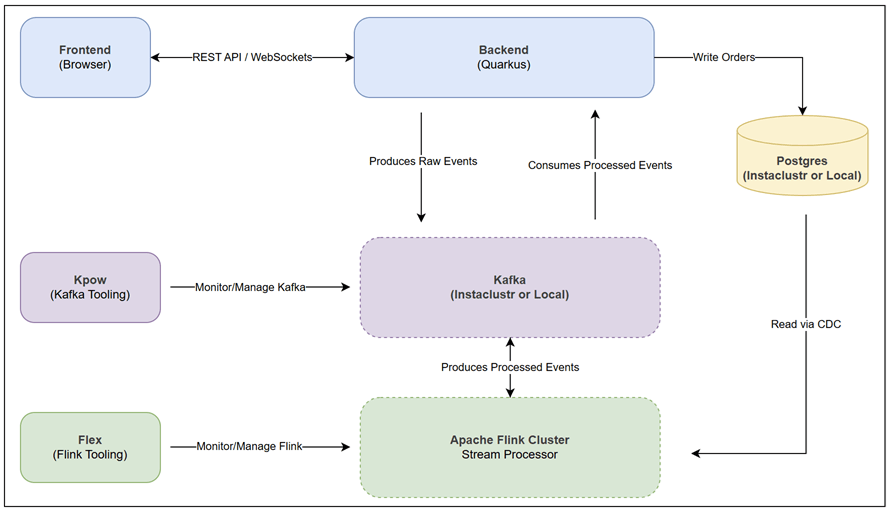
</p>

- **Frontend App**: The user interface within the browser that interacts with the backend via REST APIs and WebSockets.
- **Quarkus API**: The backend application that handles core business logic. It writes orders to the Postgres database and produces raw order events into the Kafka cluster. It also consumes processed _inventory_ events from Kafka to update the frontend.
- **Postgres**: The primary transactional database.
- **Kafka Cluster**: The central message bus for all real-time events.
- **Apache Flink Cluster**: A stream processing platform that runs applications for order processing and inventory management in real time.
- **Tooling (Kpow and Flex)**: Provides monitoring and management capabilities for the Kafka and Flink clusters, respectively.

### Quarkus API

The Quarkus API serves as the central backend, handling synchronous user-facing interactions and asynchronous event processing. It orchestrates the checkout process, manages real-time data synchronization, and exposes REST endpoints for the frontend.

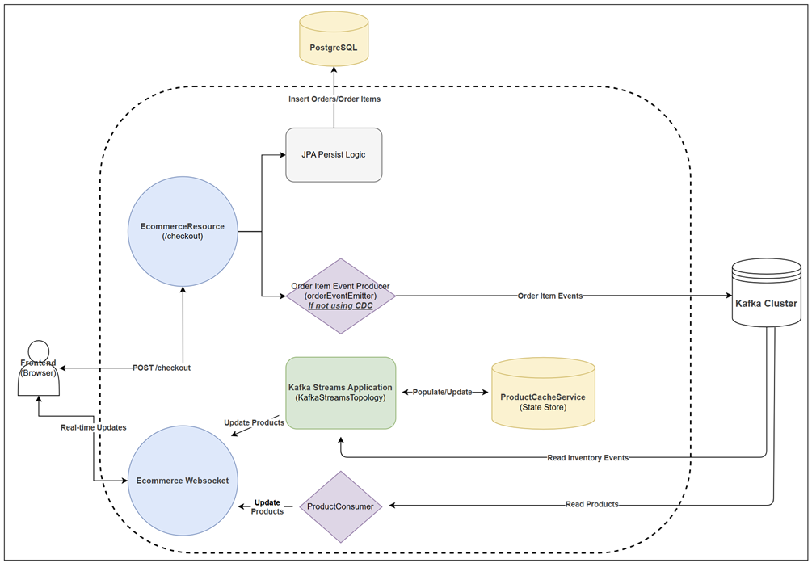

#### Core Functionality

- **Checkout and Inventory Event Logic**: The `/checkout` endpoint orchestrates order persistence and determines how inventory updates are triggered based on the `useCdc` frontend flag:
  - **Direct Event Publishing (`useCdc=false`)**: The API iterates through order items and immediately produces events to the Kafka `order-events` topic using the `orderEventEmitter`. These events are consumed downstream by Flink for real-time calculation.
  - **CDC-Driven Publishing (`useCdc=true`)**: Direct publishing is skipped. The system relies on the Flink CDC Job to capture the database transaction and drive the inventory workflow.

- **Real-time Product State Management**: The API employs a dual-consumer strategy to build a complete, real-time view of product data:
  - **Kafka Streams Application**: Consumes the `inventory-events` topic to process partial updates (e.g., stock level changes) and merges them into the in-memory cache.
  - **Standard Kafka Consumer (`ProductConsumer`)**: Subscribes to the `products` topic to retrieve full static details (e.g., name, description, initial price).

- **Unified Cache and WebSocket Updates**: Upon receiving events from either consumer, the system executes a unified update function that:
  1.  **Updates Internal Cache**: Modifies the `ProductCacheService` state store to ensure REST API calls return low-latency, up-to-date data.
  2.  **Pushes to Frontend**: Broadcasts the updated product object to all connected clients via `EcommerceWebsocket` for immediate UI reflection.

#### Key Design Patterns

- **CQRS (Command Query Responsibility Segregation)**: The KTable materialization serves as a highly optimized read model for queries, while Flink jobs handle the complex command and write logic.
- **Event Sourcing**: Product state is derived dynamically from a continuous stream of inventory events rather than relying solely on direct database queries.
- **Materialized Views**: The `products-cache` KTable provides a queryable, in-memory view of product inventory, eliminating the need to hammer the database for state.
- **Stateful Stream Processing**: Utilizes Kafka Streams state stores to maintain robust application state across restarts and failures.
- **Real-time Cache Invalidation**: Product cache updates are pushed to clients immediately via WebSocket, ensuring eventual consistency between the backend and the UI.

#### Race Condition Prevention

The implementation specifically addresses a race condition where inventory events might arrive before full product details:

- **Problem**: Inventory events from Flink arrive before the `ProductConsumer` receives the full product objects, leading to potential null pointer exceptions or incomplete data.
- **Solution**:
  - **Filter**: `PRODUCT_ADDED` events are filtered out of the stream topology to prevent premature creation.
  - **Merge Logic**: Partial updates in `ProductCacheService.updateProduct()` only merge into existing products; they do not create new incomplete entries.
  - **Logging**: Warnings are logged when updates are received for unknown products.
  - **UI Safeguard**: The system waits for the full product payload from the `products` topic before displaying the item in the UI.

### Flink Applications

The stream processing layer comprises two composable Flink jobs that process order data and manage product inventory in real-time.

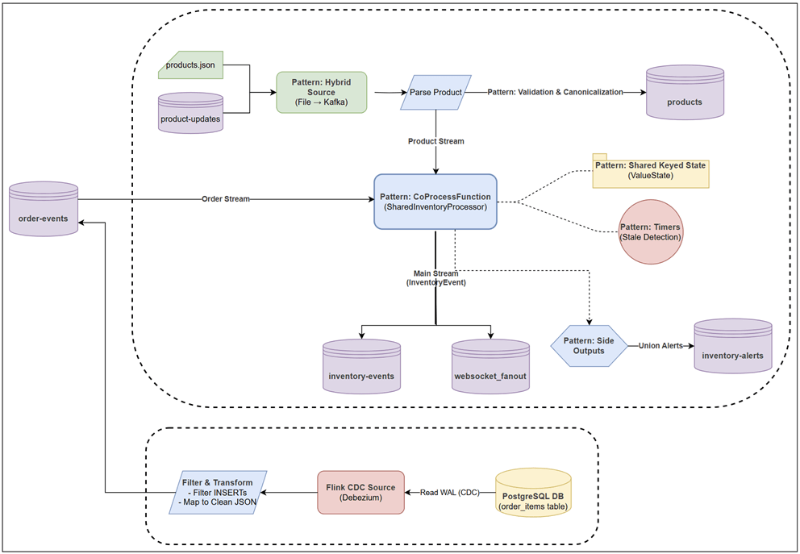

#### Order Processing and Inventory Management (`InventoryManagementJobWithOrders`)

This core stateful processing job consumes product catalog updates and real-time order events to calculate inventory levels, generate alerts, and publish enriched data streams.

**Key Patterns Implemented:**

- **Pattern 01: Hybrid Source for State Bootstrapping**: Uses a `HybridSource` to read a distinct file (`initial-products.json`) to bootstrap the job with the full catalog before seamlessly switching to the Kafka `product-updates` topic for real-time events.
- **Pattern 02: Co-Processing Multiple Streams**: Utilizes a `CoProcessFunction` to `connect` the product stream and the order stream. This enables unified logic and shared state management across different event types.
- **Pattern 03: Shared Keyed State**: Maintains `ValueState` keyed by `productId`. This ensures that both catalog updates and order deductions modify the same consistent state for any given product.
- **Pattern 04: Timers for Event Generation**: Registers processing time timers to monitor product "staleness." If no events occur within a configured window, the `onTimer` callback emits a `STALE_INVENTORY` event to signal that data requires investigation.
- **Pattern 05: Side Outputs**: Routes business alerts (`LOW_STOCK`, `OUT_OF_STOCK`, `PRICE_DROP`) to dedicated side outputs, keeping the main data flow clean. These are later unioned into a specific alerts topic.
- **Pattern 06: Data Validation & Canonicalization**: Parses raw inputs into clean `Product` objects and sinks them to a canonical `products` topic for consumption by other microservices.

**Output Streams:**

- `products`: Enriched, clean product data.
- `inventory-events`: Main stream of inventory and price changes.
- `inventory-alerts`: Dedicated stream for generated business alerts.
- `websocket_fanout`: Copy of inventory events optimized for UI updates.

#### Flink CDC (`OrderCDCJob`)

This job bridges the transactional database with the event-streaming ecosystem by capturing changes from PostgreSQL in real-time.

**Process Flow:**

1.  **Capture**: Uses Flink CDC (Debezium) to non-intrusively read the PostgreSQL Write-Ahead Log (WAL).
2.  **Filter**: Isolates only `INSERT` (op: "c") events occurring in the `order_items` table.
3.  **Transform**: Maps the raw database event into a clean JSON message containing only `productId`, `quantity`, `orderId`, and `timestamp`.
4.  **Publish**: Pushes the standardized events to the `order-events` Kafka topic for downstream consumption.

<br>

> 💡 **What is Flink CDC?**
>
> [Flink CDC](https://nightlies.apache.org/flink/flink-cdc-docs-stable/) is a specialized library that enables the direct ingestion of database changes into Apache Flink jobs.
>
> - How It Works: Flink CDC embeds the Debezium engine directly inside the Flink Source function. It automatically performs a consistent snapshot of the existing database tables and then seamlessly switches to reading the transaction logs (e.g., PostgreSQL WAL, MySQL Binlog) to capture real-time updates.
> - Comparison with Debezium Kafka Connector:
>   - Architecture: The traditional Debezium approach requires a separate _Kafka Connect_ cluster to pull data from the DB and push it to Kafka topics before Flink can process it (`DB -> Kafka Connect -> Kafka -> Flink`). Flink CDC bypasses this entirely (`DB -> Flink`).
>   - Infrastructure Efficiency: By running the CDC logic within the Flink TaskManager, it eliminates the need to maintain and monitor a Kafka Connect cluster and reduces the storage overhead of intermediate raw topics.

## 🚀 Before Training Day

### Prerequisites

Ensure students have:

- **Docker Desktop** installed and running
- **Node.js**: Version `18.x` or higher.
- **Python**: Version `3.10` or higher.
  - Note it must include `pip` (package installer) and `venv` (virtual environment support).
- **8GB RAM** minimum (16GB recommended)
- **Internet connection** (for downloading dependencies)
- **macOS or Linux** (Windows with WSL2 works too)

### One-Time Environment Setup

**Run this script ONCE before the training:**

```bash
./setup-environment.sh
```

This installs:

- ✅ SDKMAN (Java version manager)
- ✅ Java 11 (for building Flink jobs)
- ✅ Java 17 (for running Quarkus)
- ✅ Verifies Docker Desktop
- ✅ Verifies Node.js 18+
- ✅ Verifies Python 3.10+

**Estimated time:** 5-10 minutes

**Expected output:**

```
╔════════════════════════════════════════════════════════════════╗
║              ✨  Setup Completed Successfully!  ✨             ║
╚════════════════════════════════════════════════════════════════╝

Verified & Installed Components:
  ✓ Docker:     Docker version 24.x
  ✓ Node.js:    v20.x.x
  ✓ npm:        10.x.x
  ✓ Python:     Python 3.12.3
  ✓ SDKMAN:     5.x.x
  ✓ Java 11:    11.0.25-tem
  ✓ Java 17:    17.0.13-tem
```

💡 (Optional) A database client can help you query records in your PostgreSQL database. Recommended options include [DBeaver Community](https://dbeaver.io/) and [pgAdmin](https://www.pgadmin.org/).

---

## 📚 Training Day Schedule

### Setup Instaclustr Instances

For this workshop, we will set up the core data infrastructure for our application using Instaclustr's managed platform. Your tasks are separated into two parts: creating a Kafka cluster and connecting to a pre-provisioned Postgres database.

⏩ Skip this section if you are using local Kafka and PostgreSQL instances.

#### 1. Your Task: Create an Apache Kafka Cluster

Your first task is to provision a new Apache Kafka cluster. This will serve as the central message bus for all real-time events in our application.

- Please follow the official Instaclustr guide to create your cluster: **[Creating an Apache Kafka Cluster](https://www.instaclustr.com/support/documentation/apache-kafka/getting-started/creating-a-kafka-cluster/)**.

Once the cluster is provisioned and running, take note of your connection details (especially the Broker Addresses and credentials), as you will need them for the upcoming steps.

💡 Quickly verify if you can reach your Kafka cluster using [netcat](https://linux.die.net/man/1/nc):

```bash
# Syntax: nc -vz <bootstrap-address> <port>

# Example:
nc -vz 54.79.220.204 9092
# Output:
# Connection to 54.79.220.204 9092 port [tcp/*] succeeded!
```

This confirms that the host and port are reachable and that a service is listening.

#### 2. Provided For You: PostgreSQL Database

To pre-configure logical replication for Flink CDC, a PostgreSQL database has already been provisioned for the workshop.

- You **do not** need to create this yourself.
- Your workshop instructor will provide you with the necessary connection details (host, port, database name, user, and password).

💡 Quickly verify if you can reach your PostgreSQL cluster using [netcat](https://linux.die.net/man/1/nc):

```bash
# Syntax: nc -vz <host-url> <port>

# Example:
nc -vz 15.134.112.202 5432
# Output:
# Connection to 15.134.112.202 5432 port [tcp/postgresql] succeeded!
```

This confirms that the host and port are reachable and that a service is listening.

### Request Factor House Community License

In this workshop, we'll use Kpow and Flex to monitor Apache Kafka and Apache Flink clusters. Both tools are covered by a single, free Community license that you need to activate.

Please follow these two simple steps:

1.  **Generate Your License**: Go to the [Factor House Getting Started](https://account.factorhouse.io/auth/getting_started) page to generate your personal license.
2.  **Create `license.env` File**: Once generated, copy the license environment variables and paste them into a new file named `license.env`. You can use `license.env.example` as a reference for the correct format.

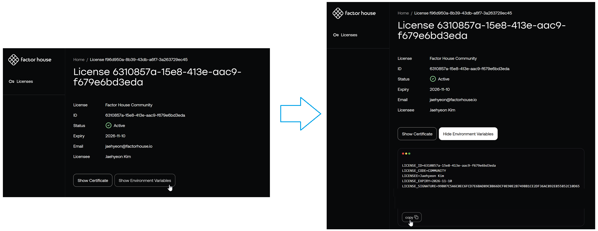

### Platform Startup

#### Goal

Get the core KartShoppe platform running **without any Flink jobs**.

#### What's Running?

```
┌─────────────────────────────────────────────────────────────┐
│  PLATFORM ARCHITECTURE (No Flink Yet)                       │
├─────────────────────────────────────────────────────────────┤
│                                                             │
│  Frontend (React) ←─ Quinoa ─→ Quarkus API                  │
│                                     ↓                       │
│                                WebSockets                   │
│                                     ↓                       │
│                                   Kafka                     │
│                                                             │
└─────────────────────────────────────────────────────────────┘
```

<br>

Here are steps to start and stop the training platform depending on which instances (Instaclustr or local) are used for the workshop.

<details open>
  <summary><b style="font-size: 1.4em;">🚀 Running with Instaclustr Managed Services</b></summary>

---

#### 1. Configure Connection Credentials

First, we need to tell our application how to connect to your newly created Kafka cluster and the provided PostgreSQL database.

- Open the `.env` file in the project root.
- Using the connection details from your Instaclustr Kafka cluster and the provided PostgreSQL credentials, fill in the required values.
- You can use the `.env.remote` file as a template to see which variables are needed.

---

#### 2. Activate the Remote Configuration for the Backend API

The Quarkus backend API needs a specific configuration file to connect to remote services. This command applies the configuration required for the application to work with Instaclustr services.

```bash
# This replaces the default properties with the one configured for remote connections
cp quarkus-api/src/main/resources/application.properties.remote \
   quarkus-api/src/main/resources/application.properties
```

---

#### 3. Create the Kafka Topics

Our Flink jobs need specific topics in Kafka to read from and write to. The following script will set up a Python virtual environment and create them for you.

```bash
# Create and activate a Python virtual environment
# On Linux and macOS, Python 3 may be invoked using `python3` instead of `python`.
python -m venv venv
source venv/bin/activate

# Install required Python packages
pip install -r scripts/requirements.txt

# Run the script to create topics on your Instaclustr Kafka cluster
# After activating a virtual environment,`python` can be used regardless of the system’s Python invocation.
python scripts/manage_topics.py --action create

# ...
# [2025-11-18 14:12:33,605] INFO: Topic 'websocket_fanout' created
# [2025-11-18 14:12:33,605] INFO: Topic 'processing_fanout' created
# [2025-11-18 14:12:33,605] INFO: Topic 'ecommerce_events' created
# [2025-11-18 14:12:33,605] INFO: Topic 'ecommerce_processing_fanout' created
# [2025-11-18 14:12:33,605] INFO: Topic 'product-updates' created
# [2025-11-18 14:12:33,605] INFO: Topic 'recommendations' created
# [2025-11-18 14:12:33,605] INFO: Topic 'inventory_updates' created
# [2025-11-18 14:12:33,605] INFO: Topic 'inventory-events' created
# [2025-11-18 14:12:33,606] INFO: Topic 'shopping-cart-events' created
# [2025-11-18 14:12:33,606] INFO: Topic 'basket-patterns' created
# [2025-11-18 14:12:33,606] INFO: Topic 'order-events' created
# [2025-11-18 14:12:33,606] INFO: Topic 'product-recommendations' created
# ...
```

---

#### 4. Initialize the Database Schema

Next, we'll run a script to create the `orders` and `order_items` tables in your provided PostgreSQL database.

```bash
# Ensure your virtual environment is still active
source venv/bin/activate

# Run the script to create the necessary tables
python scripts/manage_db.py --action init

# [2025-11-24 11:23:15,539] INFO: Connecting to database 'ecommerce' to initialize schema...
# [2025-11-24 11:23:15,607] INFO: Applying schema and data from '<path-to-file>/postgres-init.sql' to 'ecommerce'...
# [2025-11-24 11:23:15,652] INFO: Database schema and data applied successfully.
```

---

#### 5. Launch the Core Platform & Applications

This step launches all the moving parts of our system. The `start-platform-remote.sh` script performs two key actions:

1.  **Starts Local Services in Docker**: It launches the monitoring tools (Kpow, Flex) and the Flink cluster (JobManager, TaskManager) as Docker containers.
2.  **Starts Applications Locally**: It runs the Quarkus backend API and the frontend application directly on your machine.

```bash
./start-platform-remote.sh
```

**✅ Verification:** Once everything is running, check the following URLs:

- **KartShoppe App**: [http://localhost:8081](http://localhost:8081)
- **Kpow for Kafka**: [http://localhost:13000](http://localhost:13000)
- **Flex for Flink**: [http://localhost:13001](http://localhost:13001)

> **Note:** The product page in the KartShoppe UI will be empty. This is expected! Our Flink job, which is responsible for populating the product data, isn't running yet.

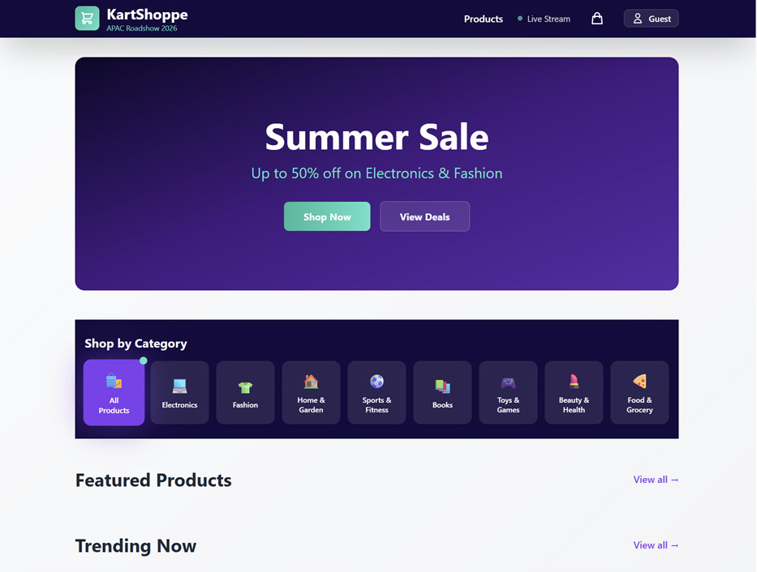

---

#### 6. Deploy the Inventory Management Flink Job

Now, let's deploy our main Flink job. This job reads the initial product data, calculates inventory, and publishes the results to Kafka, which the UI is listening to.

```bash
./flink-inventory-with-orders-job.sh
```

**✅ Verification:** After a few moments, refresh the KartShoppe UI. You should now see the products populated!

> **Try it out!** You can now experiment with adding items to your cart and completing a purchase (leave the "Use Flink CDC" box unchecked for now). Watch the inventory levels change in real time.


---

#### 7. Deploy the Flink CDC Job

Finally, deploy the second Flink job. This job uses Change Data Capture (CDC) to read order data directly from the database transaction log instead of from a direct Kafka event.

```bash
./flink-order-cdc-job.sh
```

**✅ Verification:** To test this new data path, add items to your cart and proceed to checkout.

> **Important:** On the checkout page, be sure to check the **Use Flink CDC** box before completing the purchase.

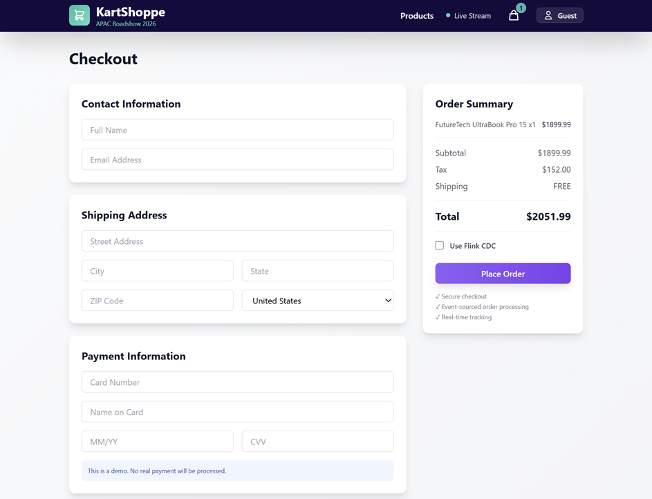

#### 8. Stopping the Workshop Environment

When you are finished with your session, you can shut down all the local components by running:

```bash
./stop-platform-remote.sh
```

This script will stop the local Docker containers and terminate the Quarkus and frontend processes. It **will not** affect your remote Instaclustr services.

</details>

---

<details>
  <summary><b style="font-size: 1.4em;">🐋 Running with Local Instances</b></summary>

---

#### 1. Configure Connection Credentials

First, we need to tell our application how to connect to the Kafka cluster and PostgreSQL database running in Docker.

```bash
cp .env.local .env
```

---

#### 2. Activate the Local Configuration for the Backend API

The Quarkus backend API needs a specific configuration file to connect to the local instances. This command applies the configuration required for the application to work with the local instances.

```bash
# This replaces the default properties with the one configured for local connections
cp quarkus-api/src/main/resources/application.properties.local \
   quarkus-api/src/main/resources/application.properties
```

---

#### 3. Launch the Core Platform

This step launches all the moving parts of our system. The `start-platform-local.sh` script performs two key actions:

1.  **Starts Local Infrastructure in Docker**: It launches the entire local data platform as Docker containers. This includes:
    - A Kafka cluster (using Redpanda)
    - A PostgreSQL database
    - Monitoring tools (Kpow, Flex)
    - A Flink cluster (JobManager, TaskManager)
2.  **Starts Applications Locally**: It runs the Quarkus backend API and the frontend application directly on your machine.

```bash
./start-platform-local.sh
```

**✅ Verification:** Once everything is running, check the following URLs:

- **KartShoppe App**: [http://localhost:8081](http-:-//localhost:8081)
- **Kpow for Kafka**: [http://localhost:13000](http-:-//localhost:13000)
- **Flex for Flink**: [http://localhost:13001](http-:-//localhost:13001)

> **Note:** The product page in the KartShoppe UI will be empty. This is expected! Our Flink job, which is responsible for populating the product data, isn't running yet.


---

#### 4. Deploy the Inventory Management Flink Job

Now, let's deploy our main Flink job. This job reads the initial product data, calculates inventory, and publishes the results to Kafka, which the UI is listening to.

```bash
./flink-inventory-with-orders-job.sh
```

**✅ Verification:** After a few moments, refresh the KartShoppe UI. You should now see the products populated!

> **Try it out!** You can now experiment with adding items to your cart and completing a purchase (leave the "Use Flink CDC" box unchecked for now). Watch the inventory levels change in real time.


---

#### 5. Deploy the Flink CDC Job

Finally, deploy the second Flink job. This job uses Change Data Capture (CDC) to read order data directly from the database transaction log instead of from a direct Kafka event.

```bash
./flink-order-cdc-job.sh
```

**✅ Verification:** To test this new data path, add items to your cart and proceed to checkout.

> **Important:** On the checkout page, be sure to check the **Use Flink CDC** box before completing the purchase.


#### 6. Stopping the Workshop Environment

When you are finished with your session, you can shut down all the local components by running:

```bash
./stop-platform-local.sh
```

This script will stop the local Docker containers and terminate the Quarkus and frontend processes.

</details>

---

#### Hands-On Exercise

1. Add 10 items of the same product to your cart
2. Watch the inventory count decrease in real-time
3. Check Flink dashboard to see events processed
4. View Kafka topic to see inventory update messages

---

## 📊 Monitor the Streaming Platform with Kpow and Flex

### Monitoring Kafka with Kpow

Kpow provides a powerful window into the Kafka cluster, allowing for the inspection of topics, tracing of messages, and production of new data.

➡️ **Kpow is accessible at:** [http://localhost:13000](http://localhost:13000).

#### Exploring Key Kafka Topics

First, it is important to understand the topics that drive the application. In the Kpow UI, navigate to the **Topics** view. While tens of topics are present, these are the most critical for the workshop:

- **`products`**: The canonical topic with the clean, validated state of all products.
- **`product-updates`**: The input topic for raw, real-time changes to the product catalog.
- **`order-events`**: Carries commands to deduct product quantity from inventory after a sale.
- **`inventory-events`**: A detailed audit log of every state change (e.g., price, inventory) for a product.
- **`inventory-alerts`**: A filtered stream for business-critical notifications like "low stock."

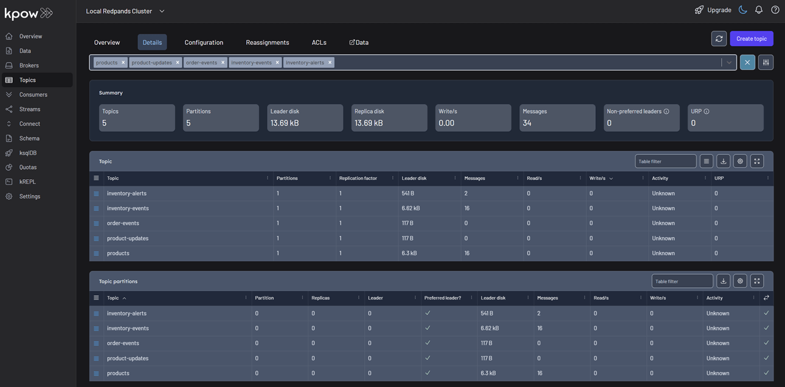

To see the initial product catalog that was loaded by the Flink job, the `products` topic can be inspected directly from the topic list. From the topic details view, locate the `products` topic. Click the **menu icon** on the left-hand side of the topic's row and select **Inspect data**.

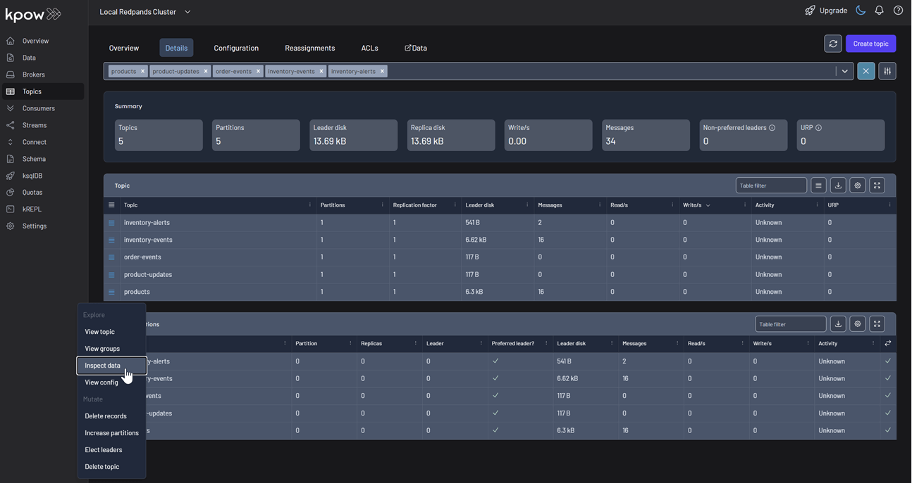

It navigates to the **Data > Inspect** page with the `products` topic already pre-selected. Simply click the **Search** button to view the messages.

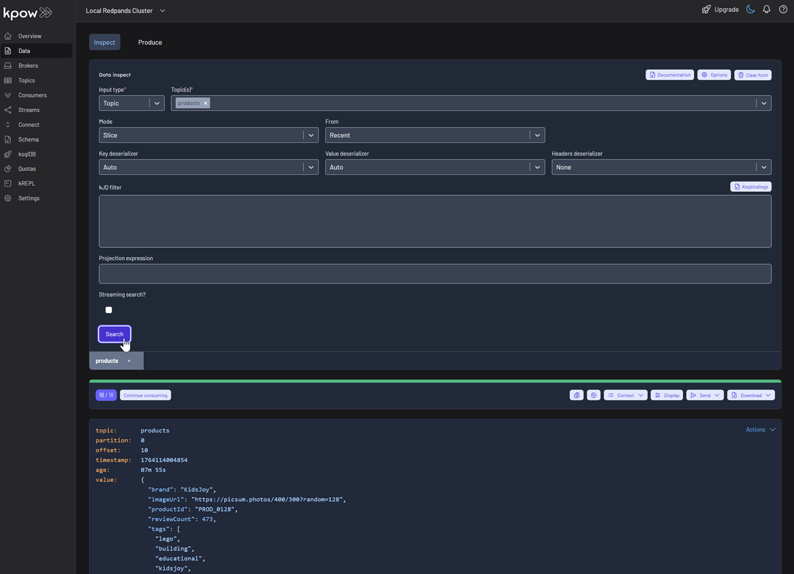

#### Tracing a Purchase Event

This section demonstrates how to trace a single purchase and observe the corresponding events in Kafka.

After a purchase of three units of the _FutureTech UltraBook Pro 15 (PROD_0001)_, two new records are expected: one in `order-events` (the command) and one in `inventory-events` (the result).

In Kpow's **Data Inspect** view:

1.  Select both the `order-events` and `inventory-events` topics.
2.  Use the **kJQ Filter** to find records related to the specific product. This helps to filter out irrelevant data. Enter the following filter:
    ```
    .value.productId == "PROD_0001"
    ```
3.  Click **Search**.

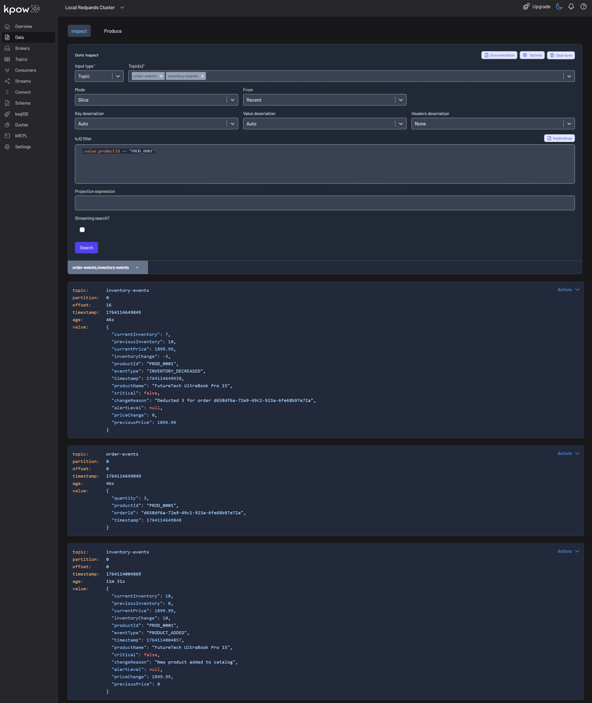

The two new records related to the purchase will be displayed, showing the command to deduct inventory and the resulting event confirming the new stock level.

#### Manually Updating Inventory

External events, like a new stock delivery, can also be simulated. This is done by producing a message directly to the `product-updates` topic. The following steps reset the inventory for the product back to 10.

1.  In Kpow, navigate to **Data > Produce**.
2.  Select the `product-updates` topic.
3.  Select `None` and `String` as the key and value deserializers.
4.  Paste the following JSON into the **Value** field.

    ```json
    {
      "productId": "PROD_0001",
      "name": "FutureTech UltraBook Pro 15",
      "description": "High-performance laptop with Intel i9, 32GB RAM, 1TB SSD. Premium quality from FutureTech.",
      "category": "Electronics",
      "brand": "FutureTech",
      "price": 1899.99,
      "inventory": 10,
      "imageUrl": "https://picsum.photos/400/300?random=1",
      "tags": [
        "laptop",
        "computer",
        "productivity",
        "futuretech",
        "electronics"
      ],
      "rating": 4.5,
      "reviewCount": 49
    }
    ```

5.  Click **Produce**.

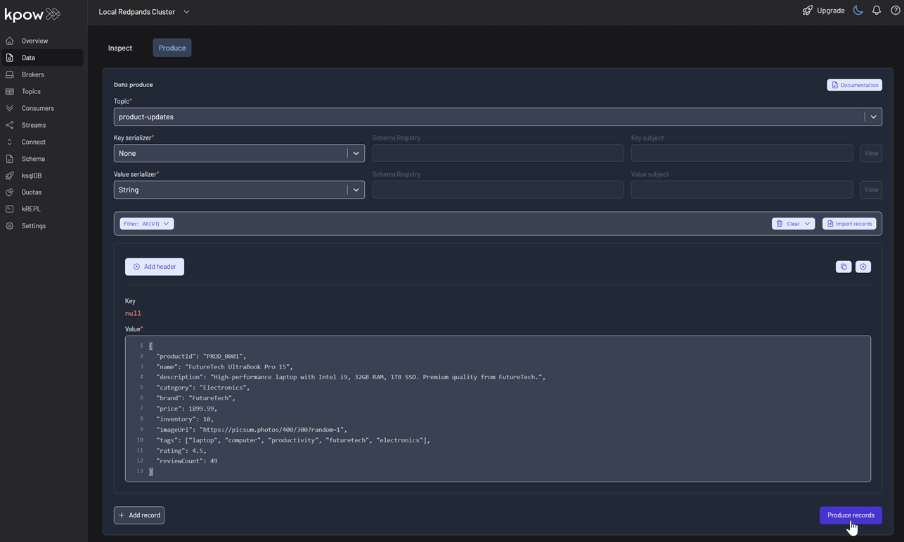

**✅ Verification:** Once the message is produced, the Flink job will process it. After refreshing the KartShoppe UI, the product's inventory will be updated to 10.

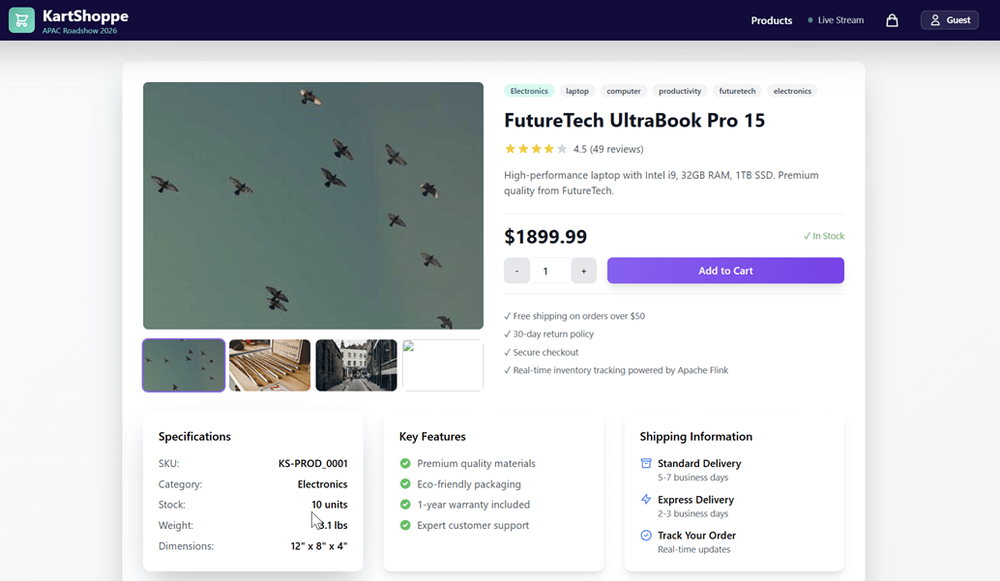

---

### Monitoring Flink with Flex

Flex provides deep insights into the Flink cluster, showing job health, metrics, and the dataflow topology.

➡️ **Flex is accessible at:** [http://localhost:13001](http://localhost:13001).

The main dashboard gives a high-level overview of the Flink cluster, including the two jobs deployed for this workshop.

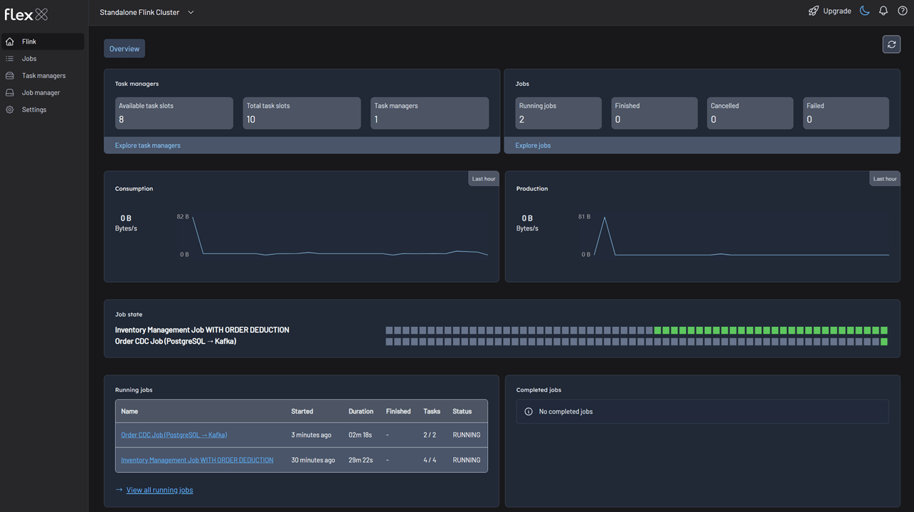

#### Visualizing a Flink Job's Topology

The dataflow graph for any job can be inspected to understand how data moves through the pipeline.

1.  Navigate to **Jobs > Inspect**.
2.  Select the `Inventory Management Job`.

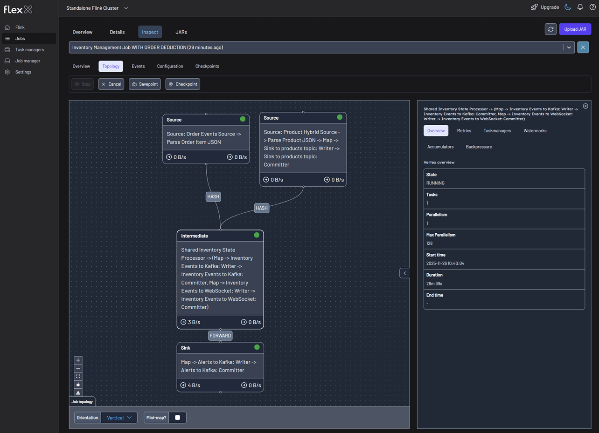

#### Viewing Logs for Debugging

Flex makes it easy to access the logs from Flink's JobManager and TaskManagers, which is essential for debugging. The logs can be checked to see the output from the Flink apps or to look for any potential errors.

- To view the **JobManager** logs, navigate to **Job Manager > Logs**.
- For **TaskManager** logs, navigate to **Task Managers**, select a specific manager, and then go to **Inspect > Logs**.

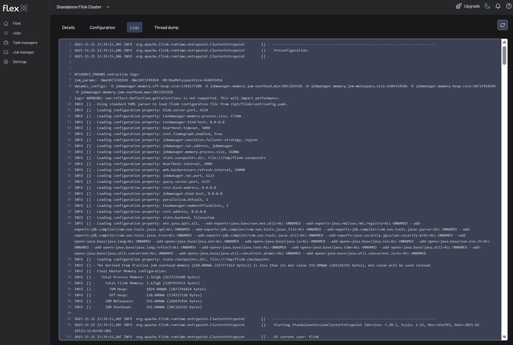

#### Cancelling a Flink Job

A running Flink job can be stopped at any time from the Flex UI.

To do this, navigate to **Jobs > Inspect** for the specific job and click the **Cancel** button in the top action bar.

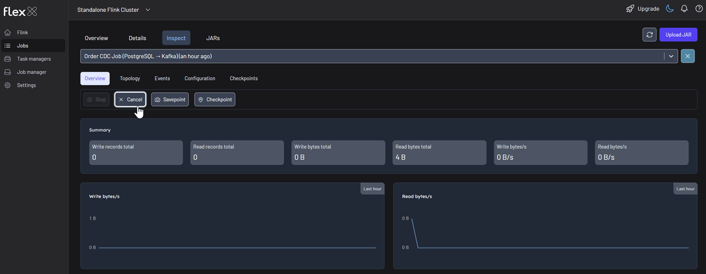

## 🎓 Training Tips

### For Instructors

1. **Show, then explain:** Start each Flink job, show the visible change, THEN explain the concepts
2. **Use the UI constantly:** Keep the browser open, refresh often to show real-time updates
3. **Monitor Flink dashboard:** Show the job graph, metrics, backpressure (http://localhost:8081)
4. **Explore Kafka topics:** Use Redpanda Console to see messages flowing (http://localhost:13000)
5. **Explain incrementally:** Each module builds on the previous - don't overwhelm with all patterns at once

### For Students

1. **Follow along:** Run commands in your own terminal
2. **Experiment:** Try breaking things! Stop a Flink job, see what happens, restart it
3. **Ask questions:** Why does this pattern need keyed state? Why use broadcast state here?
4. **Monitor everything:** Open all dashboards (Flink, Redpanda, Quarkus Dev UI)
5. **Read the logs:** `tail -f logs/quarkus.log` and Flink job logs show what's happening

---

## 🐛 Troubleshooting

### Platform Won't Start

```bash
# Check Docker
docker info

# Check Java version
java -version  # Should be 17+
# if not
sdk use java 17.0.13-tem

# View logs
tail -f logs/quarkus.log
docker compose logs -f
```

### Flink Job Fails to Start

```bash
# Switch to Java 11 for building Flink jobs
sdk use java 11.0.25-tem

# Rebuild
./gradlew :flink-inventory:clean :flink-inventory:shadowJar

# Check logs
tail -f logs/inventory.log
```

### Port Conflicts

```bash
# Kill process on port 8081 (Quarkus)
lsof -ti:8081 | xargs kill -9
```

### Docker Fails to Start Due to Existing Containers

Each Docker container must have a unique name within a Docker Compose stack. If a container with the same name already exists, Docker Compose will fail to start the stack.

Example error:

```bash
Error response from daemon: Conflict. The container name "/jobmanager" is already in use by container "61f339758f02774d7acdcd3021c4d2b9f8f9653eaea03d126bef121210689517". You have to remove (or rename) that container to be able to reuse that name.
```

This issue can be resolved by stopping and removing the existing Docker Compose environment.

```bash
## Remote
# Remove all containers in the stack
docker compose -f compose-remote.yml down

# Remove a specific container
docker compose -f compose-remote.yml down jobmanager

## Local
# Remove all containers in the stack
docker compose -f compose-local.yml down

# Remove a specific container
docker compose -f compose-local.yml down jobmanager
```

### Clean State Reset

```bash
## Stop everything
# remote
./stop-platform-remote.sh
# local
./stop-platform-local.sh

## Clean Docker volumes
# remote
docker compose -f compose-remote.yml down -v
# local
docker compose -f compose-local.yml down -v

## Clean Gradle cache
./gradlew clean
# or
./clean.sh

## Restart
# remote
./start-platform-remote.sh
# local
./start-platform-local.sh
```

---

## 📖 Additional Resources

- [Apache Flink Documentation](https://flink.apache.org)
- [Quarkus Guides](https://quarkus.io/guides/)
- [Redpanda Documentation](https://docs.redpanda.com)
- [Ververica Academy](https://www.ververica.com/academy)
- [Factor House Docs](https://docs.factorhouse.io/)
- [Instaclustr Documentation](https://www.instaclustr.com/support/documentation/)
